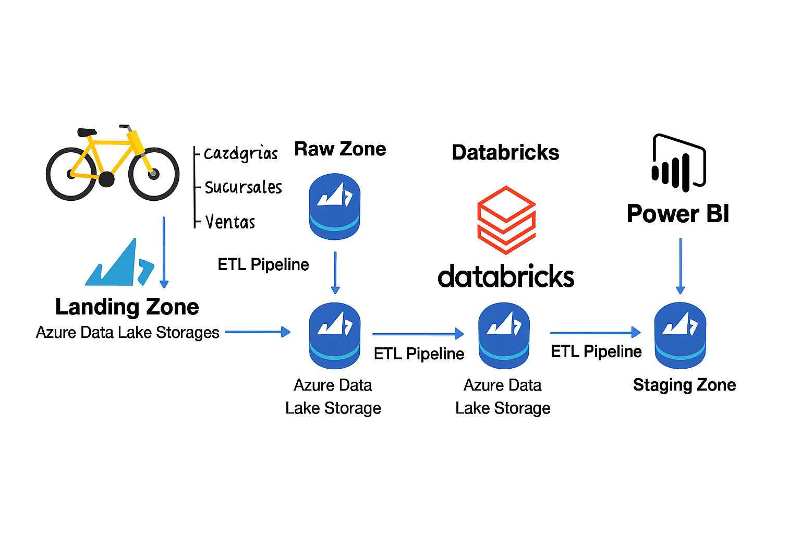
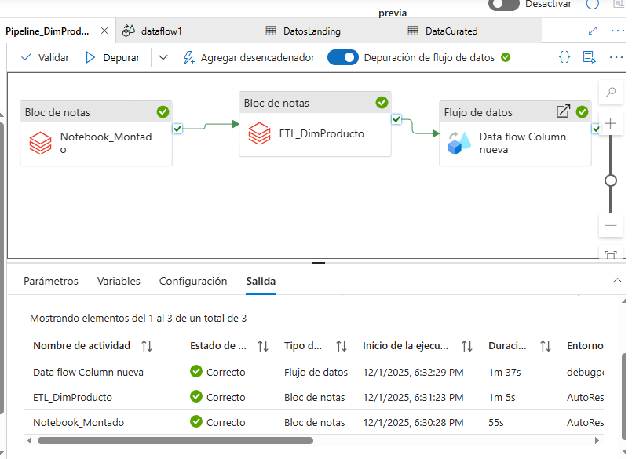
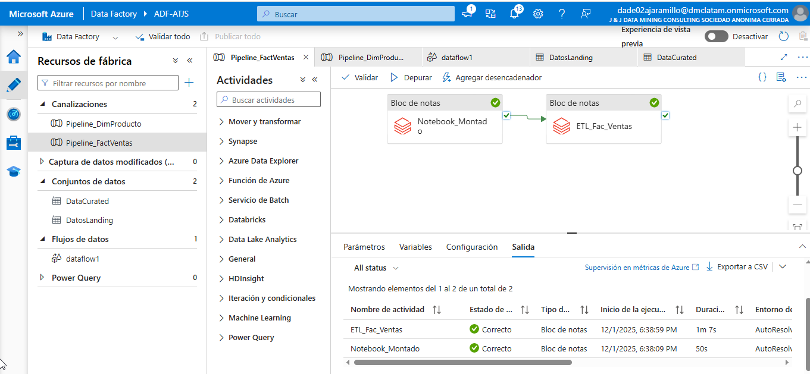

# 🚴 Proyecto ETL – Tienda de Bicicletas

## 📌 Problemática
La tienda de bicicletas enfrenta dificultades para **gestionar y analizar sus datos de ventas y productos**:
- Los datos provienen de múltiples fuentes (categorías, subcategorías, productos, sucursales, ventas).
- No existe un **repositorio centralizado** que permita integrar y transformar la información.
- Los reportes actuales son manuales y poco confiables, dificultando la toma de decisiones sobre inventario, promociones y desempeño de sucursales.
- Se requiere un **pipeline automatizado** que garantice calidad, disponibilidad y trazabilidad de los datos.

---

## 🎯 Objetivos
- **Integrar** datos de productos, sucursales y ventas en un **Data Lake centralizado**.
- **Orquestar** el flujo de datos con **Azure Data Factory**, asegurando cargas programadas y confiables.
- **Transformar** la información con **Spark/Databricks**, generando tablas dimensionales y de hechos (DimProducto, DimSucursal, FactVentas).
- **Optimizar** la generación de reportes para análisis de ventas, inventario y promociones.
- **Escalar** la solución para soportar crecimiento de datos y nuevas fuentes.

---

## 📐 Alcance
- **Carga inicial** de datos desde archivos CSV (categorías, productos, sucursales, ventas).
- **Procesamiento ETL**:
  - Extracción desde zona *landing*.
  - Transformación en Databricks (limpieza, joins, creación de dimensiones y hechos).
  - Carga en zonas *raw* y *staging* del Data Lake.
- **Automatización** con pipelines en Azure Data Factory.
- **Entrega final** de datasets listos para análisis en Power BI o cualquier herramienta de BI.
- **Exclusiones**: no se incluye machine learning predictivo en esta fase, solo integración y transformación.

---

## 🏗 Arquitectura de la Solución
1. **Zona Landing (Data Lake)**  
   - Archivos CSV de categorías, subcategorías, productos, sucursales y ventas.
2. **Orquestación (Azure Data Factory)**  
   - Pipelines que mueven datos desde *landing* → *raw* → *staging*.  
   - Control de dependencias y programación.
3. **Transformación (Databricks/Spark)**  
   - Creación de tablas dimensionales (DimProducto, DimSucursal).  
   - Creación de tabla de hechos (FactVentas).  
   - Limpieza de datos (validación de claves, eliminación de registros inválidos).
4. **Zona Staging (Data Lake)**  
   - Datos transformados y listos para consumo analítico.
5. **Consumo (Power BI / Reporting)**  
   - Dashboards de ventas por producto, sucursal y categoría.

---

## ⚙️ Tecnologías
- **Azure Data Lake Storage Gen2** → almacenamiento centralizado.  
- **Azure Data Factory** → orquestación de pipelines ETL.  
- **Azure Databricks (Spark SQL, PySpark)** → transformación y modelado de datos.  
- **Power BI** → visualización y análisis de KPIs.  
- **GitHub** → versionamiento y documentación del proyecto.  

---

## 🖼 Imágenes de Arquitectura

### 🔧 Arquitectura General del Proyecto ETL

### 📦 Pipeline – DimProducto

### 📊 Pipeline – FactVentas

---

## ✍️ Autor
**Angel Teodoro Jaramillo Sulca**  
Proyecto ETL – Tienda de Bicicletas  